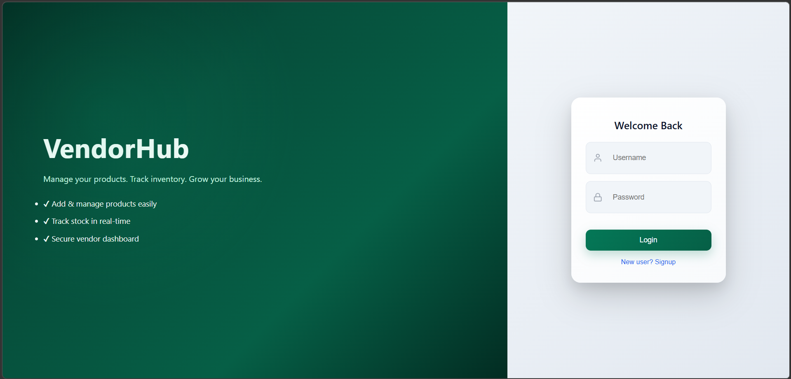
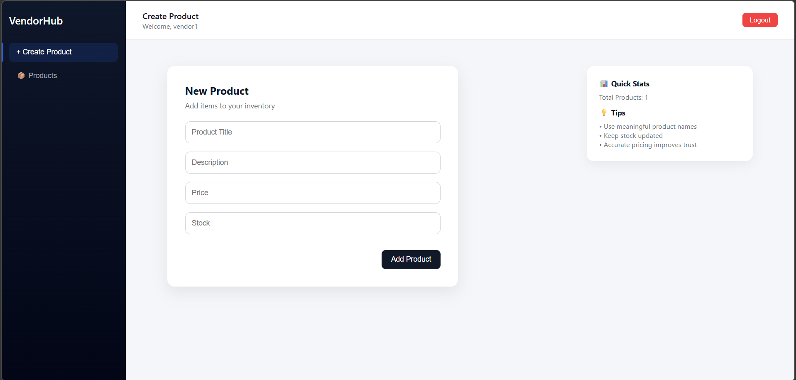

# Vendor Product Management System

A full-stack web application that enables vendors to register, authenticate, and manage their products through a secure and structured system.

This project was developed as part of a technical evaluation task and demonstrates end-to-end implementation of authentication, API design, and frontend integration.

---

## Overview

The application allows vendors to:

* Register and log in securely
* Perform CRUD operations on products
* View and manage only their own products

The system ensures proper authentication and data isolation per vendor.

---

## Features

* Vendor Registration
* Vendor Login with JWT Authentication
* Protected API endpoints
* Product Management (Create, Read, Update, Delete)
* Vendor-specific data access (each vendor can access only their own products)
* Clean and responsive user interface

---

## Tech Stack

### Backend

* Python
* Django
* Django REST Framework
* JWT Authentication

### Frontend

* React.js
* Axios
* Custom CSS

### Database

* SQLite

---


## Project Structure

```text
vendor-product-management/
│
├── client/                # React frontend
│   ├── src/
│   └── package.json
│
├── server/                # Django backend
│   ├── config/
│   ├── inventory/
│   ├── users/
│   └── manage.py
│
├── requirements.txt
└── README.md
```

---

## API Endpoints

### Authentication

* POST `/users/signup/` → Register vendor
* POST `/auth/` → Login and receive token

### Products

* GET `/items/` → Get all products for logged-in vendor
* POST `/items/` → Create product
* PUT `/items/{id}/` → Update product
* DELETE `/items/{id}/` → Delete product

---

## How It Works

1. Vendor registers using username and password
2. Vendor logs in and receives a JWT token
3. Token is used for all protected API requests
4. Vendor manages products (CRUD operations)
5. Backend ensures each vendor accesses only their own data

---

## Setup Instructions

### Clone Repository

```bash
git clone https://github.com/aiswaryas211/vendor-product-management.git
cd vendor-product-management
```

---

### Backend Setup

```bash
cd server
python -m venv venv
venv\Scripts\activate
pip install -r ../requirements.txt
python manage.py runserver
```

---

### Frontend Setup

```bash
cd client
npm install
npm start
```

## Screenshots

### Dashboard


### Create Product

## Future Improvements

* Role-based access (Admin / Vendor)
* Product image upload
* Analytics dashboard
* Deployment (Docker / Cloud hosting)

---

## Evaluation Alignment

This implementation satisfies the core requirements of the task:

* Vendor authentication
* Protected APIs
* Product CRUD operations
* Vendor-specific data filtering
* Frontend integration with backend

---

## Author

Aiswarya S

---

## License

This project is intended for learning and evaluation purposes.
